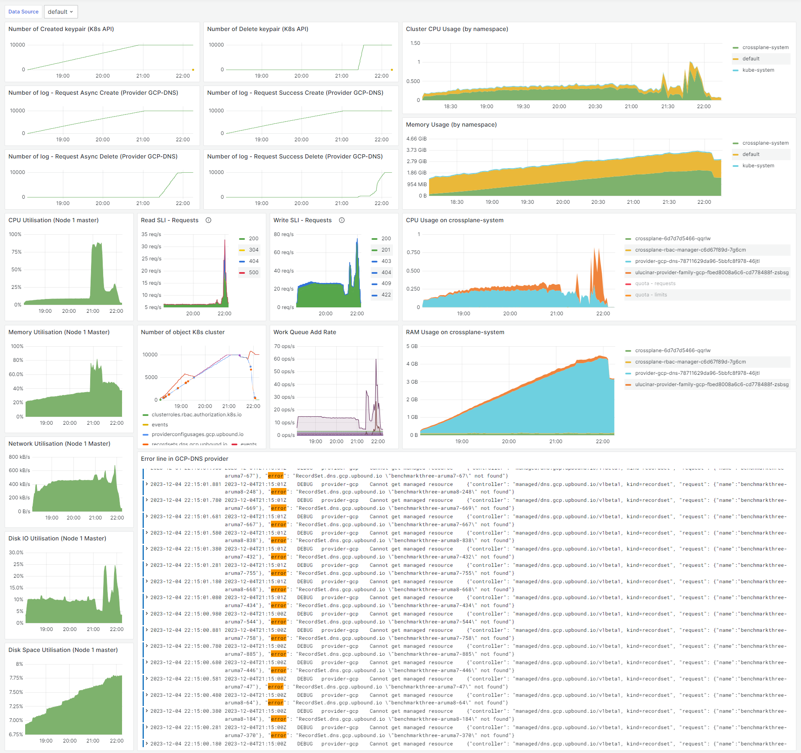
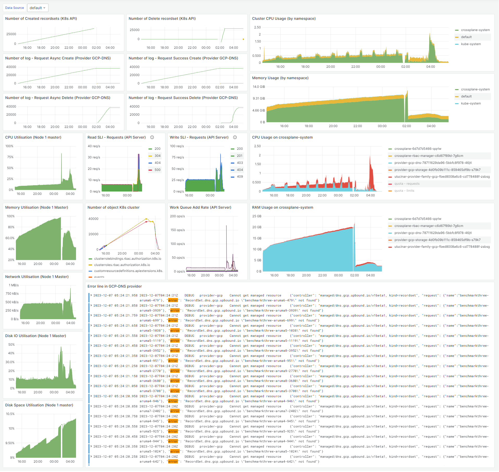

# Crossplane Benchmark on GCP - 06/12/2023

## Architecture deployed via Crossplane

Managed objects are RecordSet from a private ManagedZone.
- **Date:** 06/12/2023
- **Platform:** FE, 
- **Version:** K3s: v1.27.7+k3s2, Crossplane: v1.14, [provider-gcp-dns](https://marketplace.upbound.io/providers/upbound/provider-gcp-dns):v0.39.0-69844
- **Compute Machine type**: s6.2xlarge.2 (8vCPU/16Go)
- **Objective:** Evaluate Crossplane's performance with new Upjet release v1.0.0
- **Method:** Deployed multiple Crossplane components on a K3s cluster to monitor resource provisioning and management.

### K3s deployment

Cluster installation :
```bash
$ curl -sfL https://get.k3s.io | sh -s - server --https-listen-port 8443 --cluster-init
```

### Monitoring deployment

Installation of Grafana and Prometheus :
```bash
$ helm repo add prometheus-community https://prometheus-community.github.io/helm-charts
$ helm repo add grafana https://grafana.github.io/helm-charts
$ helm repo update
$ helm install prometheus prometheus-community/kube-prometheus-stack
$ helm install --values helm/loki.yaml loki grafana/loki
$ helm install promtail grafana/promtail
$ kubectl create ingress grafana --rule="grafana.local/*=prometheus-grafana:80"
```

Go to: http://grafana.local/

## Installation
Add *Helm* repository and install Crossplane:
```bash
$ helm repo add crossplane-stable https://charts.crossplane.io/stable
$ helm repo update
$ helm install crossplane crossplane-stable/crossplane --namespace crossplane-system --create-namespace
```

Update your credentials in the file:
- *install/gcp-provider/gcp-credentials.json*

Apply the Crossplane configuration to install the GCP and FE provider:
```bash
$ kubectl apply -k install/
```

Finally deploy the instance ressource (VMs):
```bash
$ kubectl apply -k resource/
```

## Benchmark

Benchmark have been started for multiple number of deployment object:
- 10000 RecordSets: *benchmark/results/kubeburner-gcp-on-FE.1.png*
- 40000 RecordSets: *benchmark/results/kubeburner4-gcp-on-FE.1.png*

```bash
$ kube-burner init -c benchmark/kubeburner.yml --timeout 100h 2>&1 | tee kubeburner.out
```

## Benchmark details

### Run N°1: 10 000 RecordSets

> Deployment of 10 000 recordsets. There are memory leaks, because the DNS provider's memory is not being used quickly even though there are no resources left on the cluster. 
> 
> 
> 

### Run N°2: 40 000 RecordSets

> Deployment of 40 000 recordsets. The provider restarted at 1am because of constraints on available ram.
> 
> But before this time some resource have not been created correctly. Take example of the 
[*benchmarkthree-aruma3-2075*](benchmark/result/kubeburner4-benchmarkthree-aruma3-2075.txt) RecordSet. Still exist on GCP console after the benchmark. On the log we can see that the external resource have never been created correctly. The provider try to recreated in loop the resource. In comparison, the log file for the recordset [*benchmarkthree-aruma2-2075*](benchmark/result/kubeburner4-benchmarkthree-aruma2-2075.txt) is available as correct operation.
> 